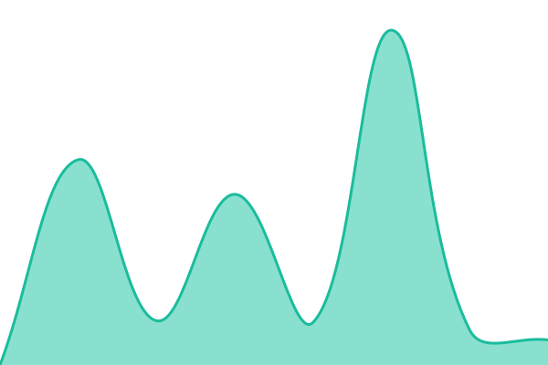

# [📈 Live Status](https://status.scraps.sbs): <!--live status--> **🟩 All systems operational**

This repository contains the open-source uptime monitor and status page for [Adenilson Ribeiro](https://status.scraps.sbs), powered by [Upptime](https://github.com/upptime/upptime).

With [Upptime](https://upptime.js.org), you can get your own unlimited and free uptime monitor and status page, powered entirely by a GitHub repository. We use [Issues](https://github.com/aaadjrbr/scraps-status/issues) as incident reports, [Actions](https://github.com/aaadjrbr/scraps-status/actions) as uptime monitors, and [Pages](https://status.scraps.sbs) for the status page.

<!--start: status pages-->
<!-- This summary is generated by Upptime (https://github.com/upptime/upptime) -->
<!-- Do not edit this manually, your changes will be overwritten -->
<!-- prettier-ignore -->
| URL | Status | History | Response Time | Uptime |
| --- | ------ | ------- | ------------- | ------ |
|  [Scraps Homepage](https://scraps.sbs) | 🟩 Up | [scraps-homepage.yml](https://github.com/aaadjrbr/scraps-status/commits/HEAD/history/scraps-homepage.yml) | 

 1140ms
     
 | 

<a href="https://status.scraps.sbs/history/scraps-homepage">73.32%</a>
    

|  [Forgot Password](https://scraps.sbs/forgot-password) | 🟩 Up | [forgot-password.yml](https://github.com/aaadjrbr/scraps-status/commits/HEAD/history/forgot-password.yml) | 

 350ms
     
 | 

<a href="https://status.scraps.sbs/history/forgot-password">73.32%</a>
    

|  [Sign Up](https://scraps.sbs/signup) | 🟩 Up | [sign-up.yml](https://github.com/aaadjrbr/scraps-status/commits/HEAD/history/sign-up.yml) | 

 283ms
     
 | 

<a href="https://status.scraps.sbs/history/sign-up">73.32%</a>
    

<!--end: status pages-->

[**Visit our status website →**](https://status.scraps.sbs)

## 📄 License

- Powered by: [Upptime](https://github.com/upptime/upptime)
- Code: [MIT](./LICENSE) © [Anand Chowdhary](https://anandchowdhary.com), supported by [Pabio](https://pabio.com)
- Data in the `./history` directory: [Open Database License](https://opendatacommons.org/licenses/odbl/1-0/)
